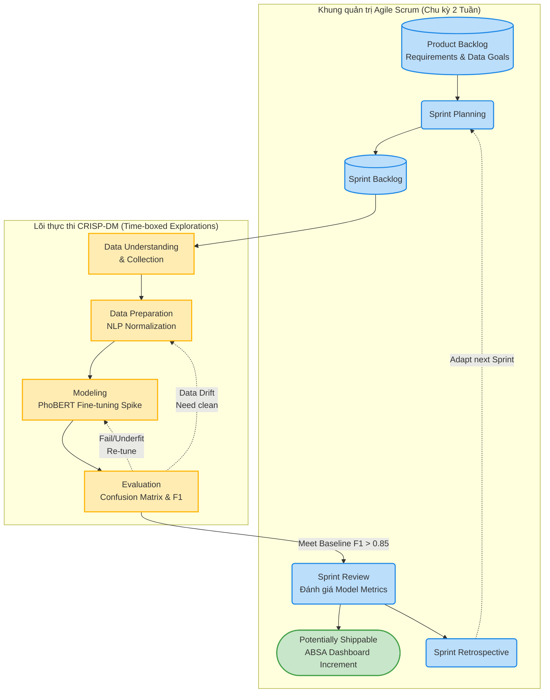
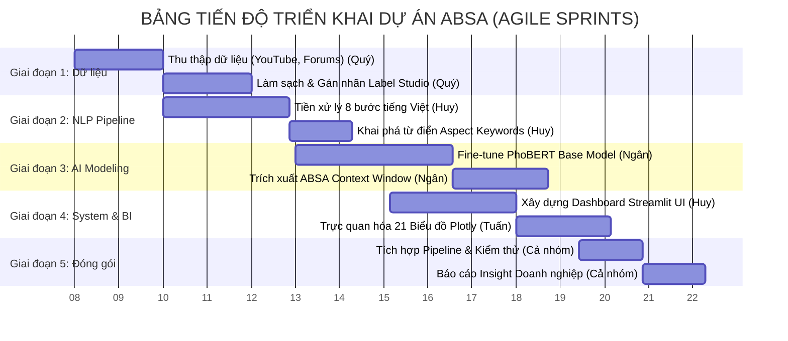

# BÁO CÁO MÔN HỌC: CHUYÊN ĐỀ 4 (IT) - SENTIMENT ANALYSIS IN BUSINESS

**ĐỀ TÀI:** 
**HỆ THỐNG PHÂN TÍCH CẢM XÚC ĐA KHÍA CẠNH (ABSA) TRÊN MẠNG XÃ HỘI: ĐÁNH GIÁ THƯƠNG HIỆU XE ĐIỆN VINFAST VÀ BYD TẠI VIỆT NAM**

**Danh sách nhóm sinh viên thực hiện:**
1. **Châu Ngân** (Nhóm trưởng)
2. **Thanh Huy**
3. **Quý**
4. **Tuấn**

---

## MỤC LỤC TỔNG QUAN (OUTLINE BỐ CỤC CHUẨN)

### CHƯƠNG 1: TỔNG QUAN ĐỀ TÀI

**1.1. Bối cảnh và Tính cấp thiết của đề tài**

Thị trường ô tô toàn cầu đang bước vào một kỷ nguyên chuyển dịch cấu trúc sâu sắc, đánh dấu bởi sự dịch chuyển từ phương tiện sử dụng động cơ đốt trong (ICE) sang các dòng xe năng lượng mới (NEV), đặc biệt là xe điện (EV). Tại Việt Nam, quá trình chuyển đổi xanh này đang diễn ra mạnh mẽ dưới sự thúc đẩy của các chính sách vĩ mô và sự thay đổi trong nhận thức của người tiêu dùng. Trong bối cảnh đó, cuộc đua giành thị phần trở nên quyết liệt hơn bao giờ hết, đặc biệt là với sự thống trị của hãng xe nội địa VinFast và chiến lược thâm nhập thị trường quy mô lớn của các thương hiệu quốc tế, tiêu biểu là BYD. 

Đặc thù của ngành công nghiệp ô tô là tính chất "sản phẩm có độ can dự cao" (high-involvement product). Người tiêu dùng không đưa ra quyết định mua sắm dựa trên các quảng cáo truyền thống một chiều, mà chịu sự chi phối mạnh mẽ bởi dư luận trên các nền tảng mạng xã hội, các kênh đánh giá xe (YouTube reviewers), và các cộng đồng người dùng chuyên sâu (như diễn đàn Otofun). Khối lượng dữ liệu phi cấu trúc khổng lồ phát sinh từ các bình luận (comments), bài đăng (posts), và đánh giá (reviews) hằng ngày chứa đựng những thông tin giá trị về trải nghiệm thực tế, kỳ vọng, cũng như định kiến của người dùng. Để tận dụng nguồn tài nguyên này, công tác "Lắng nghe mạng xã hội" (Social Listening) không còn là một công cụ tiếp thị phụ trợ, mà đã trở thành yêu cầu tình báo kinh doanh (Business Intelligence) cốt lõi nhằm định vị thương hiệu và nắm bắt tâm lý khách hàng.

Tuy nhiên, việc phân tích dữ liệu văn bản tiếng Việt trong lĩnh vực xe điện gặp phải hai rào cản kỹ thuật nghiêm trọng. 
Thứ nhất, đặc thù ngôn ngữ mạng xã hội tiếng Việt chứa mật độ cao các từ mượn, từ lóng, và thuật ngữ chuyên ngành viết tắt (ví dụ: "pin", "sạc", "ADAS", "cập nhật OTA", "phần mềm lỗi vặt"). Phương pháp phân tích từ vựng truyền thống (Bag-of-Words) hay TF-IDF thường thất bại trong việc nắm bắt ngữ nghĩa và cấu trúc câu phức tạp.
Thứ hai, và cũng là giới hạn chí mạng nhất của các hệ thống Lắng nghe mạng xã hội hiện tại, là việc áp dụng phương pháp Phân tích cảm xúc toàn cục (Global Sentiment Analysis). Phương pháp này gán duy nhất một nhãn cảm xúc (Tích cực, Tiêu cực, hoặc Trung tính) cho toàn bộ một văn bản. Đối với sản phẩm ô tô, một đánh giá thường mang tính đa chiều và phức hợp. Lấy ví dụ một bình luận: *"Xe thiết kế đẹp, tăng tốc rất bốc nhưng phần mềm hay lỗi vặt và hệ thống trạm sạc còn chưa phủ kín"*. Khi áp dụng phân tích toàn cục, hệ thống thuật toán trung bình hóa các yếu tố và dán nhãn văn bản này là "Trung tính". Việc đánh giá này làm mất đi toàn bộ giá trị hành động (actionable insights) đối với doanh nghiệp: Đội ngũ phát triển sản phẩm không nhận biết được vấn đề của phần mềm, bộ phận hạ tầng không thấy được điểm yếu về trạm sạc, và bộ phận bán hàng không tận dụng được lời khen về thiết kế và hiệu năng.

Xuất phát từ những bất cập trên, việc phát triển một hệ thống có khả năng bóc tách và phân loại cảm xúc theo từng đặc tính cụ thể của sản phẩm trở nên vô cùng cấp thiết. Phân tích Cảm xúc Đa khía cạnh (Aspect-Based Sentiment Analysis - ABSA) là phương pháp giải quyết trực diện vấn đề này. Bằng việc tích hợp các mô hình ngôn ngữ lớn chuyên biệt (PhoBERT) và kỹ thuật phân tích cửa sổ ngữ cảnh (Context Window), thuật toán có khả năng cô lập các đặc tính (như Pin, Giá cả, Dịch vụ) và đánh giá cảm xúc độc lập cho từng yếu tố ngay trong cùng một câu. Đề tài này được thực hiện không chỉ nhằm giải quyết một bài toán kỹ thuật (IT) phức tạp trong xử lý ngôn ngữ tự nhiên (NLP), mà còn nhằm xây dựng một hệ thống đo lường sức khỏe thương hiệu (Brand Health) thực chiến, giúp các doanh nghiệp xe điện tối ưu hóa sản phẩm và định hướng chiến lược cạnh tranh dựa trên dữ liệu thực tế.

**1.2. Mục tiêu và Phạm vi nghiên cứu**

**1.2.1. Mục tiêu nghiên cứu**
Đề tài hướng tới việc xây dựng một đường ống xử lý dữ liệu (Data Pipeline) hoàn chỉnh từ khâu thu thập đến phân tích đầu cuối, và phát triển một hệ thống phân tích cảm xúc đa khía cạnh (ABSA) có khả năng vận hành thực tiễn. Hệ thống mục tiêu cụ thể bao gồm:
*   **Xây dựng Nền tảng Dữ liệu (Data Engineering):** Thiết kế và triển khai quy trình thu thập dữ liệu tự động (Scraping) từ đa nền tảng mạng xã hội. Phát triển hệ thống Tiền xử lý ngôn ngữ tự nhiên (NLP Preprocessing) trải qua 8 giai đoạn nhằm làm sạch, loại bỏ nhiễu, chuẩn hóa bộ ký tự Unicode, và xử lý từ dừng (Stopwords) chuyên biệt cho văn bản tiếng Việt.
*   **Phát triển Lõi thuật toán ABSA (Machine Learning):** Xây dựng cơ chế phát hiện khía cạnh (Aspect Detection) kết hợp với mô hình học sâu (Deep Learning) PhoBERT. Thuật toán tập trung vào việc trích xuất và phân loại cảm xúc dựa trên cấu trúc cửa sổ ngữ cảnh (Context Window), cho phép phân định độc lập các nhãn cảm xúc (Positive, Negative, Neutral) cho từng khía cạnh cụ thể ngay cả khi chúng xuất hiện đồng thời trong một đánh giá phức hợp.
*   **Trực quan hóa và Hệ thống hóa Kinh doanh (Business Intelligence):** Đóng gói toàn bộ kết quả phân tích học máy thành một hệ thống Bảng điều khiển (Dashboard) nghiệp vụ chuyên nghiệp (Production-grade UI) sử dụng Streamlit. Hệ thống cung cấp 21 biểu đồ phân tích chuyên sâu, bao gồm đo lường thị phần thảo luận (Share of Voice), bản đồ nhiệt sức khỏe thương hiệu (Aspect Heatmap), và chỉ số cảm xúc thuần (Net Sentiment Score), phục vụ trực tiếp cho quá trình ra quyết định của cấp quản lý.

**1.2.2. Phạm vi nghiên cứu**
Để đảm bảo tính khả thi và chất lượng chuyên sâu của đồ án, phạm vi nghiên cứu được quy hoạch và giới hạn trên các phương diện sau:
*   **Về Dữ liệu (Data Scope):** Đề tài tập trung phân tích nguồn dữ liệu văn bản tiếng Việt được tạo ra trong giai đoạn từ năm 2022 đến đầu năm 2026. Nguồn thu thập được khoanh vùng tại các nền tảng có tính đại diện cao cho cộng đồng người dùng xe điện: YouTube (phân tích bình luận dưới các video đánh giá xe), diễn đàn Otofun (phân tích luồng thảo luận), và Shopee (phân tích đánh giá phụ kiện xe hơi liên quan). Quy mô tập dữ liệu thô (Corpus) ước tính đạt hơn 16.000 bản ghi. Đề tài loại trừ hoàn toàn các định dạng dữ liệu hình ảnh (Images) hoặc video.
*   **Về Đối tượng Phân tích (Target Scope):** Đề tài chỉ thực hiện đánh giá, đo lường và so sánh trọng tâm giữa hai thương hiệu xe điện là VinFast và BYD. Các thương hiệu xe điện khác xuất hiện trong tập dữ liệu (như Tesla, Wuling, MG, Hyundai) chỉ đóng vai trò đối chứng ngoại vi hoặc được xử lý như dữ liệu hỗn hợp (Mixed/Unknown) chứ không đi sâu vào phân tích khía cạnh.
*   **Về Hệ thống Khía cạnh (Aspect Taxonomy):** Mọi bình luận sẽ được quy chiếu và phân loại chặt chẽ theo 6 khía cạnh cốt lõi của ngành công nghiệp ô tô điện, bao gồm: (1) Pin và Trạm sạc (Battery & Charging); (2) Phần mềm và Công nghệ (Software & Technology); (3) Hiệu năng vận hành (Performance & Driving); (4) Thiết kế nội/ngoại thất (Design & Interior); (5) Dịch vụ hậu mãi (Service & Aftersales); và (6) Giá trị và Chi phí (Price & Value).
*   **Về Ranh giới Công nghệ (Technical Boundaries):** Nghiên cứu không bao gồm việc huấn luyện các Mô hình tạo sinh ngôn ngữ lớn (Generative LLMs) từ con số không, mà kế thừa và tinh chỉnh (fine-tune) trên kiến trúc Transformer chuyên dụng cho tiếng Việt (PhoBERT). Hệ thống giới hạn ở mức độ xử lý dữ liệu theo lô (Batch Processing) định kỳ, không bao gồm cơ chế luân chuyển dữ liệu và suy luận luồng tốc độ cao (Real-time Streaming Inference).

---

### CHƯƠNG 2: TỔ CHỨC DỰ ÁN VÀ PHÂN CÔNG CÔNG VIỆC

**2.1. Phương pháp luận Quản trị dự án (Hybrid Agile CRISP-DM)**

Đặc thù của các dự án Xử lý Ngôn ngữ Tự nhiên (NLP) và Trí tuệ Nhân tạo là mức độ bất định (uncertainty) cực cao. Trái ngược với phát triển phần mềm truyền thống nơi logic được lập trình theo bộ quy tắc rẽ nhánh (if/else), việc huấn luyện mô hình học sâu (PhoBERT) phụ thuộc hoàn toàn vào chất lượng và phân phối của luồng dữ liệu thô. Các rủi ro kỹ thuật mang tính phá hủy như: mô hình không hội tụ (Underfitting/Overfitting), dữ liệu bị thiên kiến (Data Bias), hoặc bùng nổ kích thước từ vựng mượn (Out-of-Vocabulary) có thể phá vỡ toàn bộ tiến độ nếu áp dụng phương pháp phát triển tuần tự (Waterfall).

Do đó, theo xu hướng và chuẩn mực quản trị dự án Khoa học Dữ liệu (Data Science) mới nhất năm 2026, đồ án áp dụng phương pháp luận lai **Hybrid Agile CRISP-DM**. Phương pháp này dung hợp sự kỷ luật, lặp lại liên tục của khung làm việc **Agile/Scrum** với tính chất chuyên biệt, xoay vòng khám phá của tiêu chuẩn công nghiệp dữ liệu **CRISP-DM** (Cross-Industry Standard Process for Data Mining).

Dưới đây là sơ đồ luồng vận hành (Workflow Diagram) thực tế đã được áp dụng trong quá trình phát triển hệ thống ABSA của nhóm:

**Chiến lược tích hợp Hybrid trong thực tiễn đồ án:**

Sự kết hợp này giải quyết bài toán "điểm mù thời gian" trong nghiên cứu AI. Trong khuôn khổ Hybrid, **CRISP-DM đóng vai trò là bản đồ chỉ đường (Roadmap)** về mặt kỹ thuật, trong khi **Agile Scrum là cỗ máy thực thi (Delivery Engine)** điều phối nguồn lực. Đồ án chia rẽ 6 pha của CRISP-DM và nhúng chúng vào các chu kỳ Sprints như sau:

1. **Pha 1 & 2 - Business & Data Understanding (Các Sprint Khởi tạo):** Thay vì viết các tài liệu đặc tả đồ sộ (Waterfall), nhóm sử dụng các **User Stories** để định nghĩa mục tiêu kinh doanh (VD: "Là một giám đốc VinFast, tôi muốn biết khách hàng phàn nàn gì về trạm sạc"). Trọng tâm của Sprint này là *Exploratory Data Analysis (EDA)* để đánh giá rủi ro dữ liệu trước khi code mô hình.
2. **Pha 3 - Data Preparation (Các Sprint Kỹ thuật Dữ liệu):** Được đánh giá là pha tiêu tốn 60-70% thời gian dự án. Các công việc như dọn dẹp mã HTML rỗng, chuẩn hóa Unicode tiếng Việt, và xây dựng danh sách từ dừng (Stopwords) mang tính chất tuyến tính (Linear tasks) nên được quản lý chặt bằng Story Points như kỹ nghệ phần mềm truyền thống.
3. **Pha 4 & 5 - Modeling & Evaluation (Sprints Thử nghiệm Đóng hộp - Time-boxed Spikes):** Đây là khu vực rủi ro cao nhất. Trái với code phần mềm (viết là chạy), code mô hình PhoBERT có thể không hội tụ. Nhóm áp dụng kỹ thuật **Time-boxed Experimentation**. Quá trình tinh chỉnh siêu tham số (Hyperparameters) bị giới hạn khắt khe trong 4-5 ngày của một Sprint. Nếu mô hình không vượt qua mốc Baseline (F1-Score > 0.85), nhóm buộc phải chốt thất bại sớm (Fail fast) ngay tại buổi Sprint Review để quay lại Pha 3 (làm sạch lại dữ liệu) thay vì sa lầy vô thời hạn. Tiêu chí hoàn thành (Definition of Done) được dịch chuyển từ "code không bug" sang "mô hình đáp ứng ngưỡng Business Baseline".
4. **Pha 6 - Deployment (Sprint Đóng gói & CI/CD):** Đưa mô hình ABSA đã chốt vào tích hợp với hệ thống Streamlit Dashboard và tiến hành xả (release) sản phẩm liên tục để đánh giá độ trễ hiển thị (Latency) trên trình duyệt.

---

**2.2. Cấu trúc Phân rã Công việc (WBS) & Lịch trình Dự án**

Để hiện thực hóa phương pháp Hybrid Agile trên, tổng khối lượng công việc được phân rã thành các gói (Work Packages) và trải dài trên trục thời gian thực tế 15 tuần. Dự án áp dụng sơ đồ Gantt để quy hoạch điểm nghẽn và luồng bàn giao (Handoff) giữa các thành viên.

### 2.2.1. Biểu đồ Thời gian Gantt (Gantt Chart Timeline)

### 2.2.2. Bảng Phân công Chi tiết và Ma trận Trách nhiệm

Với định hướng sản phẩm chuẩn doanh nghiệp, bộ máy nhân sự 4 người được phân vai tương ứng với các vị trí chuyên môn trong một đội ngũ Dữ liệu thực thụ (Data Squad). Sự phân chia đảm bảo tính cân bằng về khối lượng kỹ thuật và logic nghiệp vụ.

| Thành viên | Vai trò (Role) | Chịu trách nhiệm Cốt lõi (Core Responsibilities) | Kết xuất Đầu ra (Deliverables / Codebase) |
| :--- | :--- | :--- | :--- |
| **Châu Ngân** *(Nhóm trưởng)* | **AI/ML Engineer & Scrum Master** | **Lõi Trí tuệ Nhân tạo:** Điều phối các phiên Sprint. Chịu trách nhiệm toàn bộ quá trình huấn luyện (Training), tinh chỉnh (Fine-tuning) mô hình ngôn ngữ PhoBERT. Xây dựng thuật toán phân tích cửa sổ ngữ cảnh (Context Window) để gán nhãn đa khía cạnh độc lập. Thiết kế các đồ đo đánh giá mô hình. | File thuật toán lõi `absa.py`. Các file trọng số mô hình đã huấn luyện (Model Weights). Biểu đồ đo lường Loss/Accuracy và Confusion Matrix. |
| **Thanh Huy** | **Data Engineer & Frontend Dev** | **Đường ống Dữ liệu & Giao diện:** Thiết kế kiến trúc chuyển giao dữ liệu (Data Pipeline). Xây dựng hệ thống bộ lọc NLP Tiếng Việt (chuẩn hóa Unicode, xử lý Teencode). Chịu trách nhiệm thiết kế và lập trình giao diện Dashboard Streamlit tương tác chuẩn UI/UX. | File lõi `pipeline.py`, từ điển cấu hình `config.py`. Toàn bộ khung giao diện `app.py` và kiến trúc Dark-theme CSS. |
| **Quý** | **Data Sourcing & QA Engineer** | **Khai thác & Đảm bảo Chất lượng Dữ liệu:** Thiết kế các Crawler/Scraper để chắt lọc dữ liệu thô từ API YouTube và luồng DOM của diễn đàn. Xử lý Anti-bot. Khởi tạo môi trường Label Studio, thiết kế guideline gán nhãn thực tế chuẩn xác cho hàng ngàn bản ghi làm mồi huấn luyện. | Các tập dữ liệu thô `raw_ev_corpus.csv`. Tài liệu hướng dẫn gán nhãn (Annotation Guideline). |
| **Tuấn** | **Data Analyst & BI Specialist** | **Phân tích Kinh doanh & BI:** Tiếp nhận dữ liệu đã qua xử lý ABSA để xây dựng hệ thống 21 biểu đồ Plotly tương tác. Tính toán các độ đo kinh doanh (Net Sentiment Score, Share of Voice). Dịch thuật các con số thuật toán thành Báo cáo định vị thương hiệu (Business Insights) có khả năng sinh lời. | Module phân tích `pages_analytics.py`. Trọn bộ 21 biểu đồ xuất ra định dạng ấn phẩm. Phần kết luận báo cáo Insight thị trường. |

---

### CHƯƠNG 3: CƠ SỞ KHOA HỌC VÀ NỀN TẢNG THUẬT TOÁN (NLP & ABSA)
**3.1. Tổng quan về Phân tích Cảm xúc trong Kinh doanh**
* Định nghĩa và ứng dụng của Sentiment Analysis trong Business Intelligence.
* Các độ đo đánh giá: Tỷ lệ tích cực/tiêu cực, Net Sentiment Score (NSS).

**3.2. Phương pháp Phân tích Cảm xúc Đa khía cạnh (ABSA)**
* Khái niệm ABSA và sự vượt trội so với phân tích cảm xúc mức độ câu (Sentence-level).
* Phương pháp tách trích khía cạnh (Aspect Extraction) và trích xuất cửa sổ ngữ cảnh (Context Window).

**3.3. Kiến trúc Mô hình Học sâu PhoBERT**
* Kiến trúc Transformer và cơ chế Attention.
* Ưu điểm của mô hình ngôn ngữ tiếng Việt (PhoBERT) trong việc hiểu ngữ nghĩa và từ lóng mạng xã hội.
* Kỹ thuật tinh chỉnh (Fine-tuning) mô hình cho tác vụ phân loại đa lớp (Multi-class Classification).

---

### CHƯƠNG 4: XÂY DỰNG DATA PIPELINE & TIỀN XỬ LÝ DỮ LIỆU
**4.1. Pha Thu thập Dữ liệu (Data Acquisition)**
* Cấu trúc bộ thu thập đa nền tảng (YouTube Scraper, Forum Scraper).
* Dữ liệu tổng hợp và các rào cản kỹ thuật (Anti-bot, Rate limits).

**4.2. Pha Tiền xử lý Ngôn ngữ Tự nhiên (NLP Preprocessing)**
* 8 giai đoạn chuẩn hóa văn bản Tiếng Việt: Xóa HTML rác, Chuẩn hóa Unicode, Tách từ (Word Segmentation), Xử lý từ viết tắt/Teen code, Lọc Stopwords.
* Ứng dụng tập luật ngôn ngữ (Linguistic Constants) trong ngành công nghiệp ô tô.

**4.3. Định nghĩa Khía cạnh (Aspect Taxonomy)**
* Hệ thống từ điển từ khóa (Keywords) cho 6 khía cạnh: `BATTERY_CHARGING`, `SOFTWARE_TECHNOLOGY`, `PERFORMANCE_DRIVING`, `DESIGN_INTERIOR`, `SERVICE_AFTERSALES`, `PRICE_VALUE`.

---

### CHƯƠNG 5: KIẾN TRÚC HỆ THỐNG VÀ KẾT QUẢ THỰC NGHIỆM
**5.1. Triển khai Hệ thống Dashboard (Production-grade UI)**
* Cấu trúc kiến trúc ứng dụng Streamlit (Overview, ABSA Explorer, Analytics, Live Demo).
* Giao diện UI/UX chuẩn Premium Dark-theme (Glassmorphism).

### CHƯƠNG 5: KIẾN TRÚC HỆ THỐNG VÀ KẾT QUẢ THỰC NGHIỆM
**5.1. Triển khai Hệ thống Dashboard (Production-grade UI)**
* Cấu trúc kiến trúc ứng dụng Streamlit (Overview, ABSA Explorer, Analytics, Live Demo).
* Giao diện UI/UX chuẩn Premium Dark-theme (Glassmorphism).

**5.2. Kết quả Đánh giá Mô hình (Model Performance)**
* Đồ thị Training Loss và Validation Accuracy của PhoBERT.
* Báo cáo phân loại (Classification Report): Precision, Recall, F1-Score.
* Phân tích Ma trận nhầm lẫn (Confusion Matrix).

**5.3. Đo lường Thị phần Thảo luận và Định vị Thương hiệu (Share of Voice)**
* Phân bổ thị phần thảo luận (Brand Distribution) và Chỉ số cảm xúc thuần (Net Sentiment Score - NSS).
* Phân tích xu hướng thời gian (Temporal Trends) và Độ tương tác (Engagement Density) giữa VinFast và BYD.

**5.4. Phân tích Định tính và Khám phá Khía cạnh (Qualitative & Aspect Deep Dive)**
* So sánh sức khỏe thương hiệu qua bản đồ nhiệt khía cạnh (Aspect Heatmap) và Radar Chart.
* Trích xuất và giải nghĩa bình luận thực tế (Representative Verbatim): Lý giải nguyên nhân cốt lõi hình thành cảm xúc người dùng đối với các khía cạnh (Pin, Phần mềm, Dịch vụ).

---

### CHƯƠNG 6: KẾT LUẬN VÀ ĐỀ XUẤT GIẢI PHÁP KINH DOANH
**6.1. Tổng kết Kết quả Đạt được**
* Về mặt công nghệ kỹ thuật (Data & AI Pipeline).
* Về mặt giá trị khai phá kinh doanh (Business Insights).

**6.2. Đề xuất Giải pháp Kinh doanh (Actionable Recommendations)**
* **Phát triển Sản phẩm (Product):** Các hạng mục cần cải thiện dựa trên chỉ số cảm xúc tiêu cực.
* **Tiếp thị và Truyền thông (Marketing):** Định hướng thông điệp truyền thông dựa trên thế mạnh cạnh tranh.
* **Chăm sóc Khách hàng (Customer Support):** Phương án tối ưu hóa dịch vụ hậu mãi và xử lý khủng hoảng thông tin mạng xã hội.

**6.3. Hạn chế của Hệ thống và Hướng phát triển**
* Hạn chế về nguồn dữ liệu và độ trễ xử lý.
* Định hướng tích hợp Generative AI và tự động hóa báo cáo trong tương lai.

---
*Tài liệu tham khảo*
